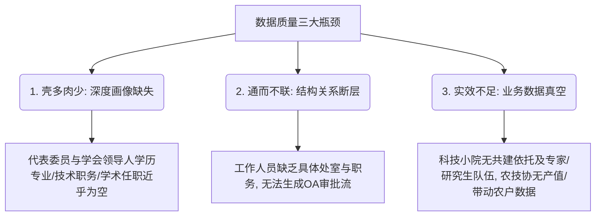

# 中国科协组织体系数据建设与质量分析报告

## 一、 报告背景与定位

本报告依据《关于中国科协组织体系信息化系统建设实施方案》（下称《实施方案》）的总体规划与决策部署，对照“完善‘智慧科协’平台，有序推进省市县三级科协领导机构人员信息系统和三级学会会员库建设”的战略任务，对当前系统底座汇聚的八大核心专题数据进行盘点与诊断。

《实施方案》明确要求在 **2026年3月** 完成代表大会、会员管理等数据梳理与铺底准备。为此，本报告主要依托最新整理的 **《组织体系数据情况_v2.docx》**，全面核实当前八大专题数据的填充情况、逻辑分布与质量短板，旨在为科协领导及网信办提供关于“数据底座成熟度”的客观评估，并提出切实可行的下一阶段治理路径。

---

## 二、 数据建设现状与质量概览

目前，科协组织体系信息化系统已初步汇聚了覆盖各级科协、学会以及基层组织的数据底座。整体数据体量较大，但在不同专题之间，数据的“完整度”与“可用性”存在明显的非均衡特征。

### 1. 八大专题数据汇聚体量统计
* **省市县科协数据**：共汇聚 **2,247** 家科协组织信息（含32个省级科协、379个市级科协、1,806个县级科协，以及外部补录的26家全国学会和30家市级科协）。
* **代表委员、领导人员数据**：共汇聚 **269,843** 名代表委员，是目前体量最大的人员实体库。
* **工作人员数据**：共汇聚 **17,404** 名科协系统内部在职员工信息。
* **学会数据**：共汇聚 **227** 家学会组织的基本工商与登记数据。
* **学会领导人信息**：共汇聚 **12,648** 条领导人与学会的关联及任职信息。
* **高校科协数据**：共汇聚 **1,034** 家高校科协组织的数据资源。
* **农技协数据**：共汇聚 **18,486** 家农村专业技术协会组织信息。
* **科技小院信息**：共汇聚 **100** 个科技小院的申报与管理信息。

### 2. 组织体系数据质量高管看板
基于各专题字段的填充比率及核心业务支撑能力，对当前数据质量进行综合评定：

| 序号 | 专题数据集 | 数据体量 (行) | 核心字段平均覆盖率 | 0% 覆盖率字段比例 | 整体质量评级 | 核心业务支撑度 |
| :--- | :--- | :---: | :---: | :---: | :---: | :--- |
| **1** | 省市县科协数据 | 2,247 | 93.41% | 0.00% | **优 (A)** | 极高（已具备组织树底座能力） |
| **2** | 代表委员、领导人员数据 | 269,843 | 29.80% | 10.14% | **中 (C)** | 中等（基本身份完备，专业画像缺失） |
| **3** | 工作人员数据 | 17,404 | 44.59% | 15.00% | **中 (C)** | 较低（难以支撑OA审批及处室分发） |
| **4** | 学会数据 | 227 | 56.71% | 22.64% | **良 (B)** | 中等（在册学会信息较好，章程缺失） |
| **5** | 学会领导人信息 | 12,648 | 8.89% | 85.19% | **差 (D)** | 极低（属于“空壳”关联数据） |
| **6** | 高校科协数据 | 1,034 | 77.29% | 0.00% | **优 (A)** | 高（可直接支撑场景应用） |
| **7** | 农技协字段 | 18,486 | 50.81% | 6.76% | **良 (B)** | 中等（基础区划完备，经营数据较弱） |
| **8** | 科技小院信息 | 100 | 25.88% | 74.00% | **差 (D)** | 极低（仅有审批节点，无实体建设数据） |

---

## 三、 各专题数据质量深度剖析

### 1. 省市县科协数据：组织树之“根”
* **现状评估**：整体质量为 **A级（优）**。主键 ID、组织中文全称、组织机构类型等核心标识及层级字段的填充率达到 **100.00%**。省级 id（100%）、市级 id（99.82%）和县级 id（96.22%）的覆盖情况能够完美支撑省市县三级科协组织树的动态生成。
* **质量短板**：联络属性不足。作为日常通知和沟通的关键渠道，**组织邮箱**的覆盖率仅为 **74.14%**，**组织联系电话**覆盖率为 **89.19%**，这将直接影响“一体化服务”中组织间信息的分发效率。

### 2. 代表委员、领导人员数据：民主治理之“本”
* **现状评估**：整体质量为 **C级（中）**。姓名、组织名称等基本身份标识字段覆盖率达 **100.00%**。手机号覆盖率高达 **99.23%**，性别（94.27%）和出生年月（86.90%）较为齐备，基本具备了人员的联络与分类基础。
* **质量短板**：**“科技人才画像”严重缺失**。全日制学历（8.92%）、学位（6.02%）、专业（6.64%）以及在职教育学历（2.73%）填充率极低；专业技术职务（8.70%）与学术组织任职情况（如任职学会名称、国际科学组织任职等）覆盖率几乎为零。这导致无法基于此数据开展有深度的“科技人才分析与代表履职分析”。

### 3. 工作人员数据：科协一家及OA之“基”
* **现状评估**：整体质量为 **C级（中）**。主键ID、归属组织、手机号等字段填充率达 **100.00%**，姓名填充率达 **99.75%**，内部人员底册清晰。
* **质量短板**：**岗位与职务结构化信息断层**。工作人员的职务名称填充率仅为 **2.81%**，内设机构（处室/部门）的 ID 填充率仅为 **4.45%**，且更新时间与删除标识字段均为空。这意味着该表目前仅是一个“员工电话簿”，由于缺乏处室和具体职务的层级链条，**完全无法支撑组织OA的业务审批流配置**。

### 4. 学会数据：学会组织树之“躯”
* **现状评估**：整体质量为 **B级（良）**。组织 ID 和机构名称覆盖率达 **100.00%**。在 227 家学会中，有 160 家（占 **70.48%**）完成了民政部注册、法人姓名、注册资金、办公地址、联系电话等详尽信息的登记。
* **质量短板**：**章程与新媒体渠道缺失**。民政登记之外的 30% 学会信息完全为空。此外，作为核心管理凭证的**学会章程**字段填充率为 **0.00%**，官方微信公众号覆盖率仅为 **8.81%**，直接制约了学术交互社群的生态化运营。

### 5. 学会领导人信息：关键少数画像之“门”
* **现状评估**：整体质量为 **D级（差）**。ID、姓名、职位、学会名称等用以表明“谁在什么学会当什么官”的关联字段覆盖率为 **100.00%**。
* **质量短板**：**“有名字无画像”的空壳状态**。除了姓名与关联岗位外，学会领导人的手机号、邮箱、学历、专业技术职务、政治面貌等所有个人背景数据填充率全部为 **0.00%**（仅性别和民族有 2.2% 左右的极少填充）。这直接导致该表只具备“展示名册”功能，无法进行联络，更无法基于领导人背景数据进行跨系统的身份互认与科技资源倾斜。

### 6. 高校科协数据：基层示范之“样”
* **现状评估**：整体质量为 **A级（优）**。高校 ID、高校名称、科协全称以及关键的管理文档（个人会员表、科协章程）填充率均达到 **100.00%**。高校科协成立时间（98.07%）和当届换届时间（96.91%）填充极其完备，可以直接支撑上线运营。
* **质量短板**：对未来规划性数据登记不足。**计划下一次换届时间**填充率仅为 **49.81%**，部分高校科协的网址（16.83%）和微信公众号（15.96%）有待补齐。

### 7. 农技协字段：科技惠农之“翼”
* **现状评估**：整体质量为 **B级（良）**。ID、单位全称、审核状态等核心管理字段填充率为 **100.00%**。省、市、县区划信息和联系电话等字段填充率在 **95.00%** 以上，地理分布数据完备。
* **质量短板**：**经营与效能数据填报率较低**。会员数量填充率仅为 **54.93%**，年产值填充率仅为 **23.56%**，带动农户数填充率仅为 **8.31%**，单位简介填充率为 **33.45%**。这限制了在数据看板上对农技协实际惠农成效的量化展示。

### 8. 科技小院信息：人才下沉之“点”
* **现状评估**：整体质量为 **D级（差）**。主键 ID、拟建设小院名称、省市县区划以及审核状态、小院 C 端菜单等系统字段填充率为 **100.00%**，说明科技小院的申报和审批状态数据非常清晰。
* **质量短板**：**实体运营内容完全真空**。小院的共建单位、依托单位、单位简介、首席专家信息、拟入住研究生信息等所有业务实体和配置人员字段的填充率均为 **0.00%**。当前数据仅能证明“有这个审批通过的小院名字”，无法得知“这个小院由谁建设、有谁在里面工作”，离方案要求的“科技小院人才场景应用”距离较远。

---

## 四、 核心数据质量瓶颈及成因分析

针对以上数据质量现状，对照《实施方案》中“应用赋能、多维度决策、场景驱动”的战略目标，发现当前数据底座存在三个核心质量瓶颈：

### 1. 瓶颈一：人员“壳多肉少”，科技人才画像极度缺乏
代表委员（26.9万）和学会领导人（1.2万）的数据规模已然建立，但学历、学位、专业技术职务及学术组织任职等核心“人才背景属性”大面积留空。
* **业务后果**：无法实现《实施方案》要求的“科技人才多维度深度个性化分析”，也无法为“审稿人推荐、学术活动精准推送、跨系统数字身份互认”等高阶智能场景提供数据支撑。

### 2. 瓶颈二：关系“通而不联”，系统与联络属性断层
工作人员表虽然涵盖了1.7万内部人员，但处室机构 ID 覆盖率仅为 4.45%，具体职务填充率仅为 2.81%；省市县科协邮箱覆盖率偏低。
* **业务后果**：科协系统内部人员无法在系统中形成“组织 -> 处室 -> 岗位 -> 人员”的结构化流转链条，**导致《实施方案》规划的“组织OA业务审批流”根本无法运转**，同时对外的组织联络效能大打折扣。

### 3. 瓶颈三：基层“实效不足”，实体建设与经营数据真空
科技小院的人才队伍（首席专家、入驻研究生）数据填充率为 0.00%，农技协的惠农效益数据（如带动农户、年产值）填报率极低，学会章程缺失。
* **业务后果**：无法通过数据看板实时监控和展现科技小院及农技协的实际运营成效，导致基层组织树虽然“有名”，但无法与“智慧科协”平台上的具体业务场景和用户互动深度关联。

---

## 五、 下一步数据治理与提升对策

为配合《实施方案》中 **2026年5月初步建立中国科协组织体系**、**2026年9月深化应用** 的时间节点，建议立即采取以下治理举措：

### 1. 依时间节点分类治理，开展“补短板”数据采集专项行动
* **第一阶段（2026年5月底前：攻坚核心骨干数据）**
  * 协同**科技创新部**与**组织人事部**，重点攻关“学会领导人（Table 5）”与“代表委员（Table 2）”的个人深度背景数据填报（特别是联系电话、邮箱、全日制学历学位、技术职务及学术任职）。
* **第二阶段（2026年9月底前：完善中基层与业务数据）**
  * 协同**白家庄办公区**，针对“科技小院（Table 8）”和“农技协（Table 7）”开展数据充实行动，重点录入科技小院的依托单位、首席专家、入驻研究生名册，以及农技协的会员数、年产值等业务成效指标，使基层组织树“名实相副”。
  * 协同**直属机关单位**，补齐“工作人员（Table 3）”的处室机构与职务数据，确保满足组织 OA 系统的测试与部署需求。

### 2. 健全数据准入与自动质量校验机制
* **强校验限制**：在各系统管理后台（如全国学会办事大厅、代表委员场景端）对关键字段（如手机、邮箱、学历、职务）设置格式校验与必填逻辑，避免产生新增“空壳”数据。
* **外部数据共享补齐**：推动平台与民政部全国社会组织信用信息公示平台、教育部高校代码系统进行对接，利用技术手段自动比对和补全统一社会信用代码、高校代码等字段。

### 3. 实施“台账+积分权益”双轮驱动，压实联络员责任
* **台账监测落地**：网信办落实《实施方案》中的台账管理制度，在数据驾驶舱中实时监测各级地方科协、全国学会的数据汇聚进度与质量。
* **推行积分与激励机制**：严格执行联络员工作积分制，将数据完整度与质量直接转化为联络员所在组织的权益（如专属技术支持、学术资源倾斜、年度考评推荐等），通过荣誉榜和约谈督办两手抓，激发基层数据维护的积极性。
